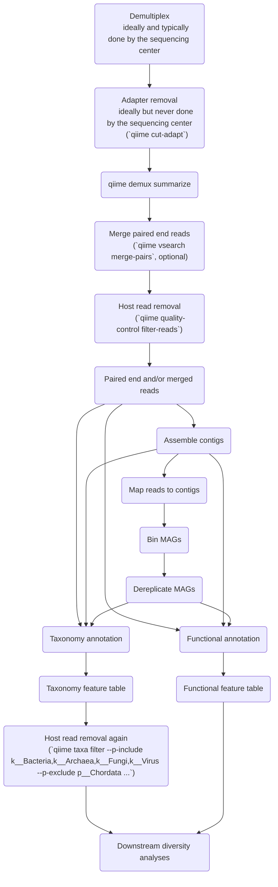

# Diagram of QIIME 2 metagenomics workflow
```{warning}
Metagenomics analysis with QIIME 2 is in alpha release.
This means that results you generate should be considered preliminary, and NOT PUBLICATION QUALITY.
Additionally, interfaces are subject to change, and those changes may be backward incompatible (meaning that a command or file that works in one version of the QIIME 2 Shotgun Metagenomics distribution may not work in the next version of that distribution).
```

This is an initial mental model of what this workflow looks like as a [mermaid flowchart](https://mermaid.js.org/).
If a graph isn't rendering below, you can copy/paste the code you see to the [mermaid live editor](https://mermaid.live/edit).


